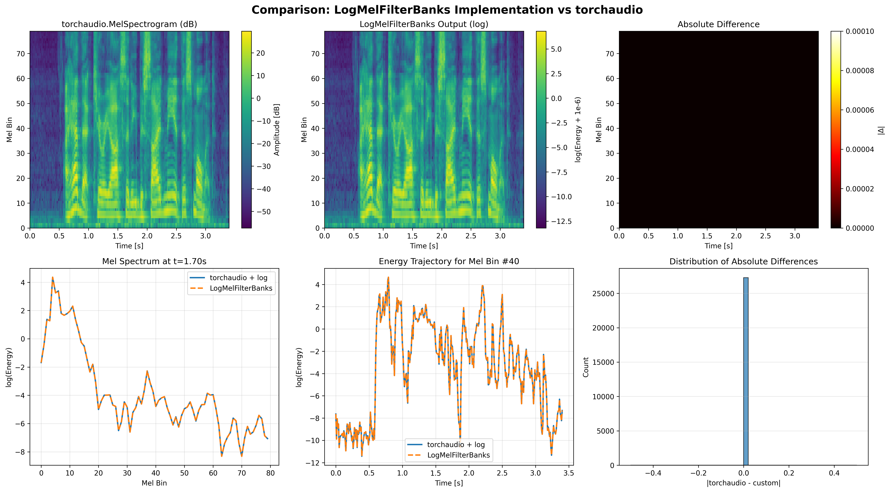

# Отчет о проделанной работе

## 1. Реализация LogMelFilterBanks

В пункте 1 был реализован собственный PyTorch‑слой `LogMelFilterBanks(nn.Module)` в файле `melbanks.py`.  Он последовательно считает STFT с окном Ханна, затем берет степенной спектр, умножает на мелфильтр банки и в конце применяет логарифм.

### 1.1. Реализация слоя

- **Метод `spectrogram`**  
  Метод `spectrogram(self, x)` вычисляет комплексную спектрограмму входного сигнала с помощью `torch.stft`. Аргументы `n_fft`, `hop_length`, `win_length`, `window`, `center`, `pad_mode`, `normalized`, `onesided` и `return_complex` берутся из атрибутов слоя. В результате получаем комплексный спектр с размерностью `(batch, n_freqs, n_frames)`.

- **Метод `forward`**  
  В методе прямого прохода сначала считается комплексная спектрограмма:
  - `spec = self.spectrogram(x)`.  
  Затем из неё формируется энергетический спектр (power‑spectrogram) с помощью поэлементного модуля и возведения в степень:
  - `power_spec = spec.abs().pow(self.power)`.  
  После этого power‑спектр умножается на матрицу мел‑фильтров:
  - сначала выполняется транспонирование к виду `(batch, n_frames, n_freqs)`,  
  - затем матричное умножение с матрицей фильтробанков размера `(n_freqs, n_mels)`,  
  - результат снова транспонируется к форме `(batch, n_mels, n_frames)`.  
  Итоговый мел‑спектр преобразуется в логарифмический масштаб:
  - `log_mel = torch.log(mel_spec + 1e-6)`,  
  где небольшое значение `1e-6` добавляется для численной устойчивости и избежания логарифма от нуля. Метод возвращает логарифмы энергий мел‑фильтробанков формы `(batch, n_mels, n_frames)`.

### 1.2. Оценка и сравнение с `torchaudio.transforms.MelSpectrogram`

Для проверки корректности реализации слой `LogMelFilterBanks` сравнивался с эталонной реализацией `torchaudio.transforms.MelSpectrogram` на аудиофайле с частотой дискретизации 16 кГц:

Сравнение происходило по форме тензоров и по элементному совпадению значений:
   ```python
   assert torch.log(melspec + 1e-6).shape == logmelbanks.shape
   assert torch.allclose(torch.log(melspec + 1e-6), logmelbanks)
   ```

На практике тензоры совпали по размерности и по значениям с точностью до численной погрешности, что подтверждает корректность реализации слоя и соответствие `LogMelFilterBanks` поведению `torchaudio.transforms.MelSpectrogram` с последующим применением логарифма.

Для наглядной проверки дополнительно были построены двумерные графики (heatmap) для `torch.log(melspec + 1e-6)` и `logmelbanks`. Визуальное сравнение показало полное совпадение структуры и динамики спектральных признаков (одинаковое распределение энергии по мел‑частотам и по времени):



## Обучение простой модели классификации

