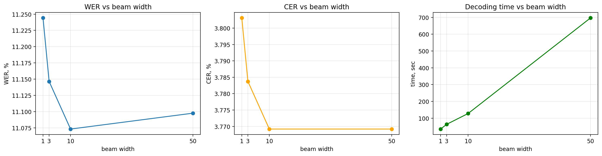
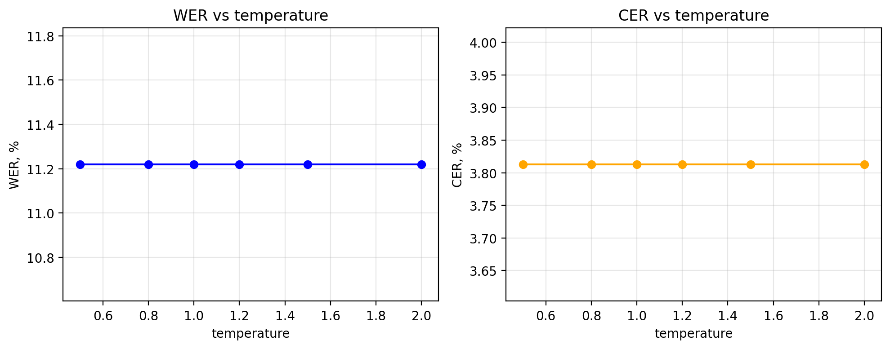
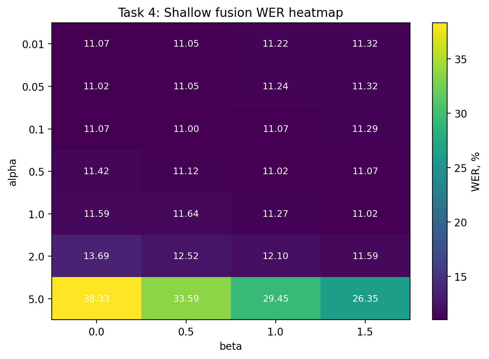
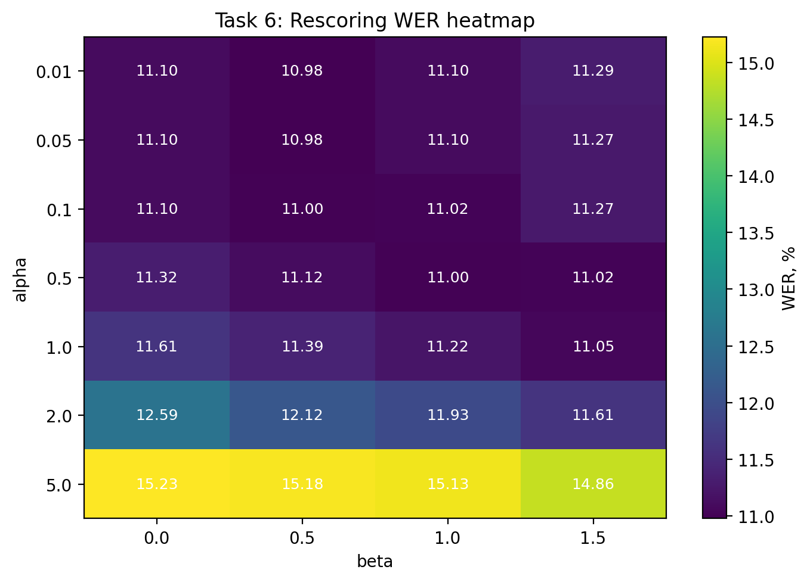
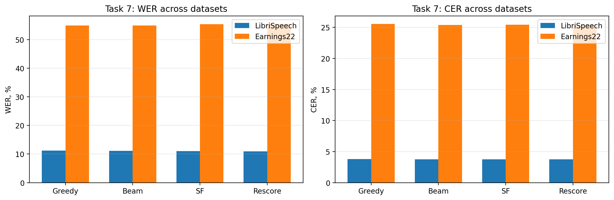
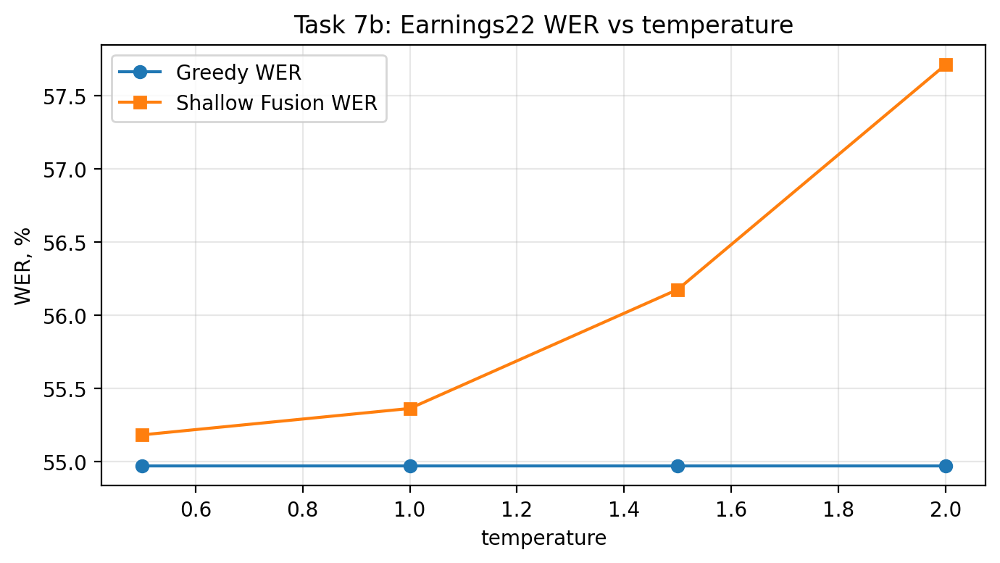
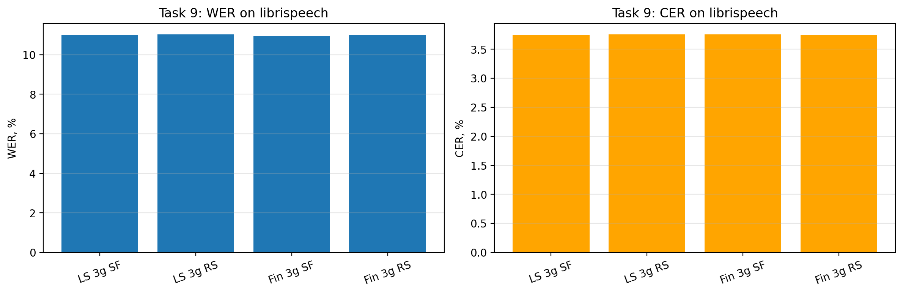
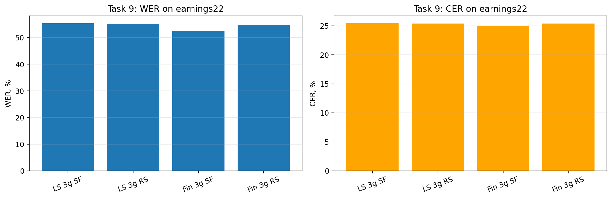

# Отчет о проделанной работе

## Task 1: Greedy decoding

Для `greedy_decode` на `LibriSpeech test-other` получены следующие значения:

| Metric | Value | Expected
| --- | --- | ---: |
| WER | 11.22% | 10.4% |
| CER | 3.81% | 3.5% |
| Time | 30.54 s | |

## Task 2: Beam search decoding

Beam search был протестирован для нескольких значений `beam_width`.

| Beam width | WER (%) | CER (%) | Time (s) |
| --- | ---: | ---: | ---: |
| 1 | 11.24 | 3.80 | 35.34 |
| 3 | 11.15 | 3.78 | 63.59 |
| 10 | 11.07 | 3.77 | 127.86 |
| 50 | 11.10 | 3.77 | 696.92 |

Референсные значения для beam search:

- `WER ≈ 9.9%`
- `CER ≈ 3.4%`

Лучший результат в моем эксперименте достигается при `beam_width = 10`:

- `WER = 11.07%`
- `CER = 3.77%`

### Анализ результатов

Beam search действительно дает небольшое улучшение относительно greedy decoding:

- greedy: `WER = 11.22%`, `CER = 3.81%`;
- beam (`beam_width = 10`): `WER = 11.07%`, `CER = 3.77%`.

Однако это улучшение очень небольшое, тогда как вычислительная стоимость растет быстро:

- переход от `beam_width = 1` к `3` и `10` чуть улучшает качество;
- переход от `10` к `50` почти не дает выигрыша по качеству;
- при этом время декодирования увеличивается очень сильно.

## Task 3: Temperature scaling

| Temperature | WER (%) | CER (%) |
| --- | ---: | ---: |
| 0.5 | 11.22 | 3.81 |
| 0.8 | 11.22 | 3.81 |
| 1.0 | 11.22 | 3.81 |
| 1.2 | 11.22 | 3.81 |
| 1.5 | 11.22 | 3.81 |
| 2.0 | 11.22 | 3.81 |

### Анализ результатов

Во всех экспериментах значения `WER` и `CER` остались одинаковыми - temperature scaling меняет распределение вероятностей, но не меняет `argmax` на каждом временном шаге.

Следовательно, на `LibriSpeech test-other` изменение температуры в диапазоне `0.5–2.0` не повлияло на результаты greedy decoding.

## Выводы по части 1

- beam search без LM дает только небольшое улучшение качества относительно greedy decoding;
- лучший результат достигается при: `beam_width = 10`;
- дальнейшее увеличение beam width почти не улучшает результат и сильно увеличивает время декодирования;
- temperature scaling не оказал влияния на greedy decoding на LibriSpeech, так как итоговый `argmax` не меняется.

## Task 4: Beam search with shallow fusion

Для shallow fusion с LibriSpeech 3-gram LM был выполнен перебор по параметрам:

- `alpha ∈ {0.01, 0.05, 0.1, 0.5, 1.0, 2.0, 5.0}`
- `beta ∈ {0.0, 0.5, 1.0, 1.5}`

Лучший результат был получен при:

- `alpha = 0.1`
- `beta = 0.5`
- `WER = 11.00%`
- `CER = 3.75%`

Референсное значение:

- `WER ≈ 9.7%`
- `CER ≈ 3.4%`

### Анализ

Shallow fusion дает небольшой выигрыш относительно обычного beam search:

- beam: `WER = 11.07%`, `CER = 3.77%`
- beam + LM (best): `WER = 11.00%`, `CER = 3.75%`

Оптимальный `alpha` оказался маленьким, что согласуется с ожидаемым поведением: на in-domain LibriSpeech акустическая модель уже достаточно сильна, поэтому слишком большой вес LM начинает вредить. Это хорошо видно на heatmap: при `alpha = 2.0` качество заметно ухудшается, а при `alpha = 5.0` деградация качества становится очень сильной.

## Task 5: 4-gram LM

Была проведена оценка с лучшими параметрами из `Task 4`.

| Model | Alpha | Beta | WER (%) | CER (%) |
| --- | ---: | ---: | ---: | ---: |
| 3-gram LM baseline | 0.1 | 0.5 | 11.00 | 3.75 |
| 4-gram LM | 0.1 | 0.5 | 11.42 | 3.82 |

### Анализ

В моем эксперименте 4-gram LM не улучшил качество по сравнению с 3-gram baseline, а наоборот немного ухудшил его. Возможная причина состоит в том, что параметры `alpha` и `beta`, подобранные для 3-gram LM, не являются оптимальными для 4-gram LM. Кроме того, более мощная LM может сильнее доминировать над акустической моделью и приводить к переоценке языковых вероятностей даже при сравнительно малом `alpha`. Еще вомзожно у меня веса модели как-то коряво скачались.

## Task 6: LM rescoring

Для second-pass rescoring был выполнен перебор по той же сетке параметров:

- `alpha ∈ {0.01, 0.05, 0.1, 0.5, 1.0, 2.0, 5.0}`
- `beta ∈ {0.0, 0.5, 1.0, 1.5}`

Лучший результат:

- `alpha = 0.01`
- `beta = 0.5`
- `WER = 10.98%`
- `CER = 3.74%`

Референсные значения:

- `WER ≈ 9.6%`
- `CER ≈ 3.3%`

### Анализ

Rescoring оказался немного лучше shallow fusion по `WER`:

- shallow fusion best: `WER = 11.00%`
- rescoring best: `WER = 10.98%`

Разница очень небольшая, но заметно, что rescoring чуть устойчивее. В отличие от shallow fusion, где LM влияет на pruning уже во время поиска, second-pass rescoring сначала сохраняет кандидатов по акустической модели, а затем переупорядочивает их с учетом LM. Поэтому при больших `alpha` деградация обычно более плавная.

В моих результатах это видно частично: rescoring на малых `alpha` стабилен, но при очень больших `alpha` качество все равно ухудшается. Тем не менее лучшая точка у rescoring чуть лучше, чем у shallow fusion.

### Qualitative examples

Ниже приведены примеры, где хотя бы один LM-based метод изменяет гипотезу относительно обычного beam search.

| idx | Reference | Beam | Shallow fusion | Rescoring |
| --- | --- | --- | --- | --- |
| 24 | a fellow who was shut up in prison for life might do it he said but not in a case like this | a fellow who as shut up in prison for life might doit he said but not in a case like this | a fellow who as shut up in prison for life might do it he said but not in a case like this | a fellow who as shut up in prison for life might do it he said but not in a case like this |
| 33 | and why did andy call mister gurr father | and why did andy call mister gurfather | and why did andy call mister gur father | and why did andy call mister gur father |
| 79 | that's right of course well armed | that's right of course willamed | that's right of course will amed | that's right of course will amed |
| 121 | i said a lad bout seventeen in a red cap like yours said gurr very shortly | i said a lad bout seventeen an a red captlic yours said gerevery shortly | i said a lad bout seventeen an a red captlic yours said gerevery shortly | i said a lad bout seventeen and a red captlic yours said gerevery shortly |
| 153 | each that died we washed and shrouded in some of the clothes and linen cast ashore by the tides and after a little the rest of my fellows perished one by one till i had buried the last of the party and abode alone on the island with but a little provision left i who was wont to have so much | each that died we washed and shrowded in some of the clothes and linen cast a shore by the tides and after little the rest of my fellows perished one by one till i had buried the last of the party and aboade alone on the island with but a little provision left i who was wont to have so much | each that died we washed and shrowded in some of the clothes and linen cast a shore by the tides and after a little the rest of my fellows perished one by one till i had buried the last of the party and aboade alone on the island with but a little provision left i who was wont to have so much | each that died we washed and shrowded in some of the clothes and linen cast a shore by the tides and after a little the rest of my fellows perished one by one till i had buried the last of the party and aboade alone on the island with but a little provision left i who was wont to have so much |

В этих примерах LM чаще всего помогает вставить пробелы между словами или чуть лучше сегментировать последовательность, хотя полностью исправить ошибки акустической модели он не может.

## Task 7: Cross-domain comparison

Я сравнила четыре метода декодинга на двух датасетах: in-domain `LibriSpeech` и out-of-domain `Earnings22`.

| Dataset | Method | WER (%) | CER (%) |
| --- | --- | ---: | ---: |
| LibriSpeech | Greedy | 11.22 | 3.81 |
| LibriSpeech | Beam | 11.07 | 3.77 |
| LibriSpeech | Beam + LM | 11.00 | 3.75 |
| LibriSpeech | Rescoring | 10.98 | 3.74 |
| Earnings22 | Greedy | 54.97 | 25.58 |
| Earnings22 | Beam | 54.94 | 25.38 |
| Earnings22 | Beam + LM | 55.36 | 25.43 |
| Earnings22 | Rescoring | 55.51 | 25.39 |

### Анализ

Разница между in-domain и out-of-domain качеством очень большая:

- на `LibriSpeech` все методы дают `WER` около `11%`;
- на `Earnings22` `WER` возрастает примерно до `55%`.

Это ожидаемо, потому что акустическая модель обучалась на LibriSpeech и никогда не видела финансовую речь. Поэтому даже дополнительная языковая модель, обученная на LibriSpeech, почти не помогает на Earnings22 и местами даже ухудшает результат. LM хорошо отражает распределение текстов LibriSpeech, но плохо соответствует лексике и стилю earnings calls.

## Task 7b: Temperature scaling on Earnings22

Для out-of-domain набора `Earnings22` был выполнен перебор:

- `T ∈ {0.5, 1.0, 1.5, 2.0}`

Результаты:

| Temperature | Greedy WER (%) | Shallow Fusion WER (%) |
| --- | ---: | ---: |
| 0.5 | 54.97 | 55.18 |
| 1.0 | 54.97 | 55.36 |
| 1.5 | 54.97 | 56.17 |
| 2.0 | 54.97 | 57.71 |

### Анализ

Для shallow fusion  при увеличении температуры качество ухудшается. Повышение `T` делает акустическое распределение более плоским, из-за чего LM получает больше влияния. На Earnings22 LibriSpeech LM не соответствует домену, поэтому усиление его влияния приводит к деградации, а не к улучшению.

## Task 9: Compare LibriSpeech LM vs Financial LM

Сравнение двух языковых моделей:

- `LibriSpeech 3-gram`
- `Financial 3-gram`

проводилось для двух методов декодинга:

- shallow fusion (`SF`)
- rescoring (`RS`)

### LibriSpeech

| LM | Method | WER (%) | CER (%) |
| --- | --- | ---: | ---: |
| LibriSpeech 3-gram | SF | 11.00 | 3.75 |
| LibriSpeech 3-gram | RS | 11.02 | 3.75 |
| Financial 3-gram | SF | 10.93 | 3.75 |
| Financial 3-gram | RS | 11.00 | 3.75 |

### Earnings22

| LM | Method | WER (%) | CER (%) |
| --- | --- | ---: | ---: |
| LibriSpeech 3-gram | SF | 55.36 | 25.43 |
| LibriSpeech 3-gram | RS | 55.06 | 25.41 |
| Financial 3-gram | SF | 52.47 | 25.00 |
| Financial 3-gram | RS | 54.82 | 25.38 |

### Анализ

На `LibriSpeech` различия между LM очень малы. Это ожидаемо: сам датасет уже является in-domain, а акустическая модель и стандартная LibriSpeech LM хорошо соответствуют условиям задачи. Интересно, что financial LM в shallow fusion показывает даже слегка лучший `WER`.

На `Earnings22` financial LM уже дает заметно лучшие результаты. Лучший результат получается у:

- `financial 3-gram + shallow fusion`
- `WER = 52.47%`

Это лучше, чем:

- `librispeech 3-gram + shallow fusion` (`55.36%`)
- `librispeech 3-gram + rescoring` (`55.06%`)

Таким образом, domain-specific LM действительно помогает на out-of-domain речи, особенно в shallow fusion. При этом financial LM в rescoring не дал столь же сильного улучшения, как в shallow fusion, что может быть связано с ограниченной мощностью кандидатов, приходящих из первого beam-search pass.

## Выводы по части 2

- shallow fusion дает небольшой выигрыш на LibriSpeech, но очень чувствителен к слишком большим `alpha`;
- 4-gram LM в моем эксперименте не улучшил результат относительно 3-gram baseline;
- rescoring показал лучший итоговый `WER` среди LM-based методов на LibriSpeech, хотя преимущество очень небольшое;
- на Earnings22 LibriSpeech LM почти не помогает и иногда ухудшает качество;
- повышение температуры на Earnings22 усиливает влияние несоответсвия между акустической моделью и неподходящей LM, поэтому shallow fusion деградирует;
- financial-domain LM действительно полезен на Earnings22 и дает лучший результат в `Task 9`.
